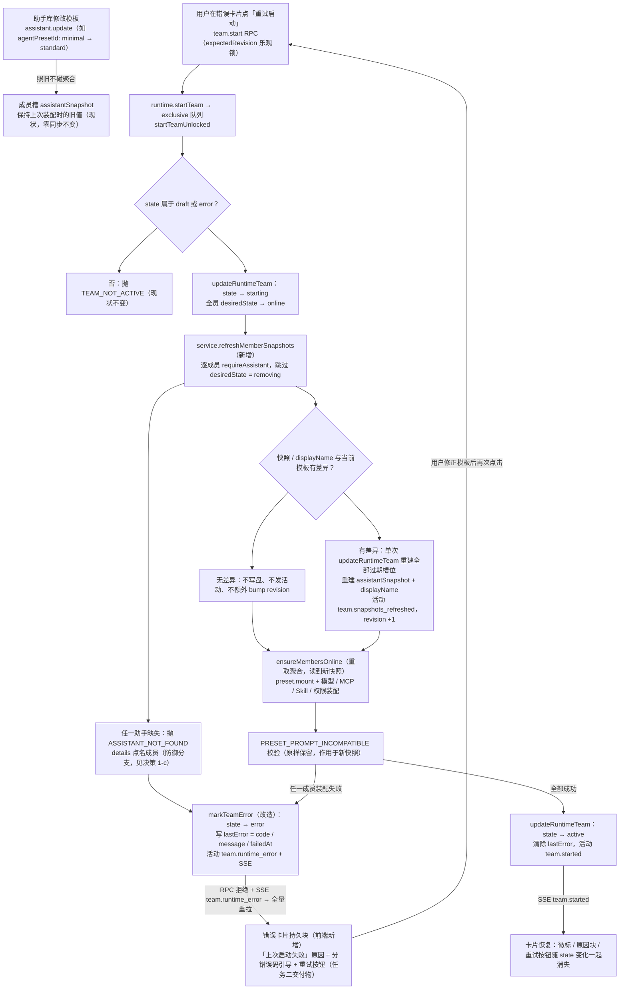
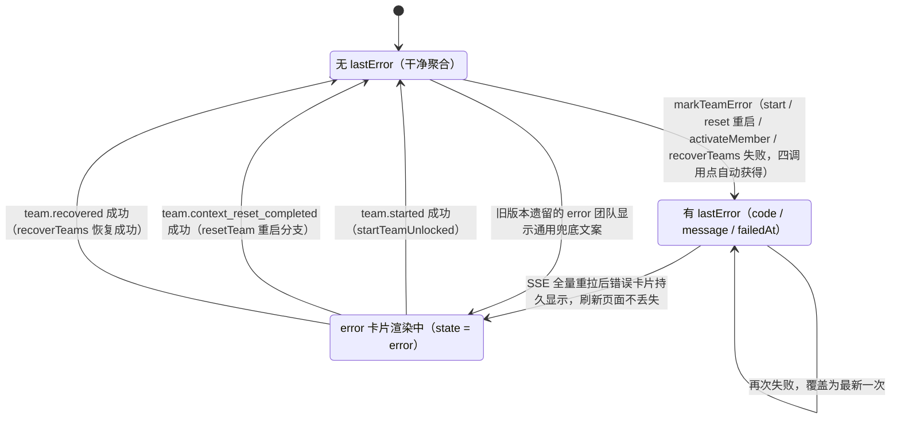

# 设计：重试启动刷新成员快照 + error 原因持久可见

- 分支：`dev/workbench-enhancements`（基线 6b348b9 + 版本提交 fa33c47）
- 类型：设计文档（不含实现代码）
- 关联：Scout 侦察任务 `62ec81fb`（本设计全部代码事实沿用其逐行核实结论，并经本文独立复核）；交接手册任务二已交付 error 卡片「启动失败」徽标 + 重试按钮
- 状态：已评审通过（队长裁决，Verifier 验证实现符合本设计）

## 0. 背景与问题（代码事实）

1. **快照固化，改模板无效**：成员槽的 `assistantSnapshot` 仅在两处生成——`createTeamDraft`（`agent-team-service.ts:462`）与 `createMemberSlot`（`agent-team-service.ts:1058`）。`updateAssistant`（`agent-team-service.ts:330-352`）只写助手库，零快照同步。启动装配全部读快照：模型选择（`team-runtime.ts:748-757`）、preset 挂载（`:759`）、MCP/Skill 白名单（`:792`/`:817`）、preset standingKey（`:840-842`）、`PRESET_PROMPT_INCOMPATIBLE` 校验（`:882-889`）。系统不存在修改存量成员 agentPreset 的任何 RPC/UI。结果：用户改模板→重试启动永远复现同一错误。
2. **失败原因不可见**：`markTeamError`（`team-runtime.ts:979-987`）只把聚合 state 置 `error` 并写一条 `team.runtime_error` 活动记录；活动表无任何 RPC 消费（`listActivities` 唯一调用点是解散清理，`agent-team-service.ts:859`），message 只进宿主日志。UI 端 error 卡片仅有客户端本地 RPC 错误（`TeamPanel.tsx:990` inlineError，刷新即丢）。

修复范围（用户已拍板）：A. 启动/重试时用当前助手库配置重建成员快照；B. 聚合新增可选 `lastError`，error 卡片持久展示失败原因与可操作引导。

## 1. 方案总览

一句话：**把快照语义从「成员创建时刻固化」改为「上次装配时刻固化」——刷新动作挂在所有会重新装配成员的启动路径上（`startTeamUnlocked`、`resetTeam` 重启分支），统一走一个 service 层刷新函数；失败原因由 `markTeamError` 顺手写进聚合 `lastError`（可选字段），三个成功路径清除，前端经 `TeamView = TeamAggregate` 零成本透出，在 error 卡片徽标下持久渲染原因 + 分错误码引导。**

### 1.1 重试启动数据流（主图）



### 1.2 lastError 生命周期（辅图）



### 1.3 方案四项自问（架构师自检）

| 自问 | 回答 |
|---|---|
| 满足全部约束？ | 是：A/B 两项全覆盖；五项裁决点逐项有决策（§2）；禁改项零触碰（§2.5）；不引入任何新依赖、新 RPC、新技术栈。 |
| 有无更简单替代？ | 有且已评估并否决：①只在 error 态重试时刷新——更少 1 处调用，但 draft→start 的同构过期问题仍在，且造成「两种启动两种语义」；②lastError 用纯 string——少一个 schema 对象，但丢失 code（引导文案分发）与 failedAt（「上次」语义）；③刷新跳过缺助手的成员——少一个失败分支，但等于带旧快照静默上线，复刻本 bug 且不可见。 |
| 隐藏风险与边界 case？ | 已逐项识别并处置：draft 队刷新失败会翻转为 error（与现有启动失败管道行为一致，§2.1-d）；成员级 permissionPreset/reasoningEffort 覆盖与 sessionId 明确不被刷新覆盖（§2.2）；旧版本遗留的无 lastError error 团队走 UI 兜底；无差异刷新跳过写盘避免 revision 空转；并发安全由既有 exclusive 队列保证；`.strict()` 带来的降级风险在回滚策略中如实披露。 |
| 回滚策略？ | 见 §5：单一 Conventional Commit + 版本 tag 回滚锚点；快照刷新半区无 schema 变更可即时 revert；lastError 半区有 `.strict()` 降级兼容风险，给出三步缓解。 |

## 2. 关键裁决（逐项决策与理由）

### 2.1 裁决一：快照刷新的时机与范围

**决策**：

- **a) 时机——所有通过 `startTeamUnlocked` 的启动统一刷新，不区分 draft→start 与 error→重试。** 实现位置：`startTeamUnlocked` 内、`state → starting` 标记之后、`ensureMembersOnline` 之前的第一步（`team-runtime.ts:697` 的 try 块首行）。依据：`startTeamUnlocked` 的闸门（`:680`）本就只放行 `draft | error`，两种启动的过期问题完全同构——建队后改模板再启动，与报错后改模板再重试，读到的是同一份过期快照。两分支分别处理是任意复杂度，统一后语义变成一条可向用户陈述的规则：**「启动（含重试）= 以助手库当前配置装配成员」**。
- **b) 范围——`team.members` 全量（含 leader），仅跳过 `desiredState === 'removing'` 的槽位**（与 `ensureMembersOnline` 的跳过规则对齐，`:719`）。leader 同样有快照、同样可能过期，无豁免理由。
- **c) 助手被删除——不跳过、不静默，整体启动失败抛 `ASSISTANT_NOT_FOUND`（details 携带成员 id 与 displayName）。** 理由：`deleteAssistant` 已有 `ASSISTANT_IN_USE` 引用闸门（`agent-team-service.ts:362-377`，扫描全部团队的全部成员），正常路径下存量成员的助手不可能被删，此分支纯属防御纵深（绕过 service 的直写、历史数据等）。跳过会让成员带着旧快照静默上线——正是本设计要消灭的行为，且用户不可见；自动移除成员是破坏性动作，超出本任务授权。响亮失败 + lastError 落盘 + 点名成员，用户可用既有 removeMember（error 态已放行）处置。
- **d) 刷新失败的落点——与其他启动失败同一条管道：** 刷新在 try 块内，异常冒泡到既有 catch（`:706-708`）→ `markTeamError` → state=error + lastError 写入 + RPC 拒绝。不另开错误通道。副作用：draft 团队刷新失败会翻转为 error——这不是新的 draft 语义变更，而是既有行为的自然延伸（今天 `PRESET_PROMPT_INCOMPATIBLE` 同样把 draft 翻成 error），且 error 卡片的徽标/原因/重试按钮恰好是这种情况最合适的呈现。
- **e) 明确不刷新的两处（负向决策，防止实现时顺手扩大范围）：**
  - `recoverTeams`（`:614-636`）不刷新。宿主启动期无人值守，自动恢复若静默应用模板变更违反最小惊讶；error 队伍恢复失败 → lastError 落盘可见 → 用户显式重试时才应用新配置，闭环仍然成立。
  - `activateMember`（`:281-317`，active 队 addMember 的上线路径）不刷新：`createMemberSlot:1058` 刚刚以当前模板建槽，天然新鲜。
- **f) 补充覆盖——`resetTeam` 的重启装配分支（`team-runtime.ts:476-487`）复用同一刷新。** 依据：reset 对非 draft 团队会销毁会话、换新 sessionId 并重新装配（`:464-469`），其成功文案就是 "restarted with fresh member contexts"——带着旧快照重启会从另一扇门复刻本 bug（用户改模板→清空→仍旧报错）。draft 分支不重启，不刷新。

### 2.2 裁决二：快照语义变更的兼容性

**决策**：接受语义收窄——快照冻结点从「成员创建时刻」移到「上次装配时刻」；**运行中团队的漂移隔离完整保留**。

理由与边界：

- 漂移隔离的核心价值是「模板编辑不扰动正在运行的团队」。新语义下 active/starting 团队没有任何刷新路径（决策 1-e 明确排除 activateMember，运行中更无重刷），跨宿主重启恢复也不刷新——运行中与恢复场景的行为与现状逐字节一致。
- 被有意放弃的旧行为只有两个，且都是本缺陷的病灶：draft 团队「建队即定稿」、error 重试「沿用旧配置」。
- 附带收益：`cloneTeam` 复制的旧快照（`cloneMemberSlot:1068-1087`）在克隆队首次 start 时自然刷新，「克隆即复制旧配置」的坑同时消除。
- **刷新内容边界（防实现走样）**：刷新只重建 `assistantSnapshot`（经 `snapshotAssistant` 纯函数）与 `displayName`（与建队语义一致地取 `assistant.name`）；**`sessionId` 不动**（保证 resume 会话历史连续，这是快照机制存在的另一半理由）、**槽位级 `permissionPresetId` 与 `reasoningEffort` 不动**（它们是用户经 setMemberPermissionPreset / setMemberReasoningEffort 显式设置的覆盖项，运行时 `:752`/`:878` 读取的是槽位值而非快照值，被模板回写吞掉属于回归）、`role`/`joinedAt`/`desiredState`/`lastRuntimeState` 不动。
- **UI 提示**：不做全局常驻提示。理由：draft 启动应用最新配置本就是用户直觉预期，常驻提示是噪音；真正需要管理预期的是 error 重试场景——由裁决四的错误卡片引导文案承担（明示「重试将以助手库最新配置重新装配成员」）。

### 2.3 裁决三：lastError 字段设计

**决策**：

- **位置：`TeamAggregate` 顶层可选字段。** 不放 member 槽（启动失败是团队级事件，四处 markTeamError 全部是团队级调用）；不放活动表（活动表无 RPC 消费且语义是流水而非状态，「读聚合即得」才是卡片渲染要的）；不放独立实体（多一张表多一套 CRUD，收益为零）。
- **形状（`src/domain/schemas.ts`，紧邻 `teamAggregateSchema:121-146`）**：

  ```ts
  export const teamLastErrorSchema = z.object({
    code: z.string().optional(),
    message: z.string(),
    failedAt: isoDate,
  }).strict()

  // teamAggregateSchema 内新增：
  lastError: teamLastErrorSchema.optional(),
  ```

  `types.ts` 导出 `TeamLastError`。**schemaVersion 保持 1，不 bump、不写迁移**——developer-guide §3 明示「新增可选字段保持向后兼容」为两条合法演进路径之一，存量 JSON 缺字段照常解析，`storage/domain.ts` version 不动。
- **写入点：仅 `markTeamError`（`team-runtime.ts:979-987`）**，扩展现有 update 函数：`lastError: { ...(error instanceof AgentTeamError ? { code: error.code } : {}), message, failedAt: new Date().toISOString() }`。四个既有调用点（startTeamUnlocked `:707`、resetTeam `:485`、activateMember `:313`、recoverTeams `:633`）自动获得能力，零新增调用。`message` 已携带成员名（`SESSION_CREATE_FAILED` 文案「成员"X"启动失败：…」，`:933`），**不另加 memberDisplayName 字段**。`code` 用 `z.string()` 而非 `AgentTeamErrorCode` 枚举——lastError 是持久数据，向前兼容未来增删错误码，避免旧数据被新枚举拒绝。
- **清除点（三处成功路径，统一 `lastError: undefined`，序列化后键自然消失）**：
  1. `startTeamUnlocked` 成功 `team.started`（`:700-705`）；
  2. `resetTeam` 重启成功 `team.context_reset_completed`（`:478-483`）；
  3. `recoverTeams` 恢复成功 `team.recovered`（`:624-629`）。
  语义：**「上次失败原因持续可见，直到被下一次成功冲销」**。清除 recoverTeams 成功路径不违反禁改项——禁的是「不改无限重试」策略，清除陈旧错误属于 B 项清除语义，且不清除会导致恢复成功后卡片永久挂着过期原因，与需求直接矛盾。
- **透出：零改动。** `TeamView = TeamAggregate`（`contracts.ts:64`），视图类型从 schema `z.infer` 推导，新字段自动到达 `team.list` / `team.get` / `team.start` 等 RPC 结果与前端；`contracts.ts`、`web.ts`、`client/api.ts` 均不动。`ownership_conflict` 态下 markTeamError 也会写 lastError，但 UI 仅在 `state === 'error'` 展示（见裁决四），无不良交互。

### 2.4 裁决四：error 卡片的持久展示与协同

**决策**：

- **位置：TeamCard header 徽标区（`TeamPanel.tsx:855-867`，任务二交付的「启动失败」徽标 + 「重试启动」按钮）之下、成员区之前，新增持久块 `.teamLastError`。** 该块不使用 `role="alert"`（持久信息不是即时告警语义），纯静态区块即可。
- **显示条件：复用 `canRetryTeamStart(team.state)`（`client/team-status.ts:12-14`）**，与徽标、重试按钮同源同生命周期：state 转 active 三者一起消失；SSE 全量重拉机制（`components.tsx:342-346`，Scout 事实 5）保证跨页面刷新可见——这正是「持久」的实现方式：存于聚合、随重拉恢复，而非客户端 state。
- **内容两行**：
  1. **原因行**：有 lastError → `上次启动失败（{failedAt 按本地时间格式化}）：{message}`；无 lastError（升级前已落盘的 error 团队）→ 兜底文案 `上次启动失败：原因未记录（升级前数据），可点「重试启动」重新获取`。
  2. **引导行**：`labels.ts` 新增 `teamStartErrorHint(code?: string): string` 错误码→文案映射。`PRESET_PROMPT_INCOMPATIBLE` 给专属文案（大意：该成员助手模板的 Agent Preset 会替换团队身份/名册提示段，请在助手库改用兼容预设，改完点「重试启动」——重试将以助手库最新配置重新装配成员）；其余错误码与未知 code 走通用兜底（检查 Workspace 可用性、模型配置与网络后重试）。引导行是「重试将应用最新配置」预期的唯一告知点（裁决二）。
- **与既有 UI 的协同**：`:990` 的 inlineError（role=alert）**保留**，分工明确——inlineError 承载操作级瞬时反馈（如重试 RPC 的同步失败、乐观锁冲突），lastError 块承载跨刷新的持久状态；两者短暂并存不冲突（重试失败时 RPC 立即 reject 到 inlineError，markTeamError 落盘后 SSE 重拉刷新持久块）。重试按钮文案、位置、busy 门控均不改（任务二交付物）。
- **样式**：`.teamLastError` 新类复用 `--dsw-alias-state-error-*` 语义令牌与既有 inlineError 的边框/内边距节奏，不引入新色板（AGENTS.md 硬性要求）。

### 2.5 裁决五：禁改项合规声明

| 禁改项 | 合规结论 |
|---|---|
| `recoverTeams` 不改无限重试 | 重试策略一行不改（`:614-636` 保持一次性恢复语义）；且按裁决 1-e 明确**不**在其中加快照刷新。唯一触碰是其成功路径 update 里加 `lastError: undefined` 一行（裁决三），属 B 项清除语义，不涉重试策略。 |
| `PRESET_PROMPT_INCOMPATIBLE` 校验保留 | `team-runtime.ts:884-889` 原样保留。刷新后 `ensureMembersOnline` 经 `this.service.getTeam(teamId)` 重取聚合（`:698` 现状即如此），mount/assemble/校验自然作用于新快照——校验防线不加不减。 |
| draft 语义不动 | draft 分支闸门全部原样：`addMember` 的 draft 放行（`:581`）、`removeMember` 的 draft 直删（`:614-623`）、`dissolveTeam` 的 draft 直删（`:852`）、`resetTeam` 的 draft 不重启（`:441`/`:475`）。draft→start 流程本身不变，仅多一步刷新；draft 队刷新失败翻转为 error 是既有启动失败管道的既有行为（裁决 1-d），非新的 draft 语义。 |

## 3. 改动文件清单（预估）

| # | 文件 | 变更点 | 预估量 |
|---|---|---|---|
| 1 | `src/domain/schemas.ts` | 新增 `teamLastErrorSchema`；`teamAggregateSchema` 挂 `lastError: teamLastErrorSchema.optional()`；schemaVersion 保持 1 | +8 行 |
| 2 | `src/domain/types.ts` | 导出 `TeamLastError`；新增纯函数 `rebuildMemberSnapshot(member, assistant): TeamMemberSlot`（重建 snapshot + displayName）与 `memberTemplateDrift(member, assistant): boolean`（与 `snapshotAssistant:45` 同区，纯函数便于单测） | +18 行 |
| 3 | `src/service/agent-team-service.ts` | 新增 `refreshMemberSnapshots(teamId): Promise<TeamAggregate>`（置于 `startTeam:627` 附近）：收集缺失助手一次性抛 `ASSISTANT_NOT_FOUND`（details 含全部缺失成员）→ 无差异不写盘 → 有差异单次 `updateRuntimeTeam`（kind `team.snapshots_refreshed`，summary 报告刷新成员数） | +35 行 |
| 4 | `src/runtime/team-runtime.ts` | ① `startTeamUnlocked` try 块首行调用刷新（`:697` 处 +1 行，`:698` 的 `getTeam` 重取现状不动）；② 成功路径 update 加 `lastError: undefined`（`:700-705`）；③ `markTeamError` 扩展写 lastError（`:979-987`）；④ `resetTeam` 重启分支在 `ensureMembersOnline` 前调用刷新并把入参从局部 `next` 换为刷新后的聚合（`:476-477`，约 +3 行），成功路径加清除（`:478-483`）；⑤ `recoverTeams` 成功路径加清除（`:624-629`） | 约 +10 / -2 行 |
| 5 | `src/client/labels.ts` | 新增 `TEAM_START_ERROR_HINTS` 映射与 `teamStartErrorHint(code?)` | +15 行 |
| 6 | `src/client/teams/TeamPanel.tsx` | TeamCard 持久错误块（header 之后渲染，条件 `canRetryTeamStart(team.state)`） | +20 行 |
| 7 | `src/client/AgentTeam.module.css` | 新增 `.teamLastError`（复用 `--dsw-alias-state-error-*` 令牌） | +15 行 |
| 8 | `tests/agent-team-service.spec.ts` | 新增约 7 个用例（见 §4） | +180 行左右 |
| 9 | `tests/client-labels.spec.ts` | `teamStartErrorHint` 映射与兜底用例 | +20 行 |
| 10 | `tests/transport-contracts.spec.ts` | 新增兼容守护：含 `lastError` 与不含 `lastError` 的聚合 JSON 均可被 `teamAggregateSchema` 解析 | +15 行 |

**明确零改动**：`src/transport/contracts.ts`、`src/transport/web.ts`、`src/client/api.ts`（TeamView 自动透出）；`src/storage/*`（version 1、无迁移）；`addMember` / `createMemberSlot` / `cloneMemberSlot`（建槽即新鲜）；`recoverTeams` 重试策略与恢复流程主体；`PRESET_PROMPT_INCOMPATIBLE` 校验块；任务二交付的徽标/按钮/`canRetryTeamStart`。

## 4. 测试策略（TDD 红-绿）

执行口径沿用仓库现行规范：`npx vitest run --pool=threads`（forks 池沙箱内挂死，必带参数；`tests/workspace-git.spec.ts` 不在沙箱内跑）+ `npm run typecheck` + `npm run guard:architecture` + `npm run build`，最后 `npm run check`。服务端用例沿用 `tests/agent-team-service.spec.ts:560-661` 的 `createHarness` + `runtimeInternals` 桩范式（桩 `ensureMemberOnline` / `messages.recover` 隔离 Agent 装配）。

**Red 先行用例（`tests/agent-team-service.spec.ts`）：**

1. `refreshes member snapshots from current templates when starting an error team`——error 团队 + `updateAssistant` 改 `agentPresetId` → `startTeam` → 断言槽位 `assistantSnapshot.agentPresetId` 与 `displayName` 为新值（**红**：现状返回旧值，即用户缺陷本体）。
2. `refreshes snapshots when starting a draft team after template edits`——draft 同构覆盖（裁决 1-a）。
3. `skips the snapshot write when templates are unchanged`——无差异时无 `team.snapshots_refreshed` 活动、revision 增量恰为 starting/started 两次（防 revision 空转）。
4. `fails start and names the member when its assistant is missing`——`store.deleteAssistant` 绕过闸门后 `startTeam` → 拒绝 `ASSISTANT_NOT_FOUND`、state=error、`lastError.message` 含成员名（裁决 1-c/d）。
5. `records lastError on start failure and clears it after a successful retry`——桩 `ensureMemberOnline` 抛 `AgentTeamError('PRESET_PROMPT_INCOMPATIBLE', …)` → 断言 `lastError = { code, message, failedAt }`；随后桩成功再 `startTeam` → state=active 且 `lastError` 清除（B 项主链路）。
6. `preserves member-level overrides across a snapshot refresh`——`setMemberPermissionPreset` / `setMemberReasoningEffort` 后刷新，槽位覆盖值不变、快照已更新（裁决二防回归的关键断言）。
7. `refreshes snapshots on reset restart and keeps recoverTeams untouched`——改模板 → `resetTeam`（非 draft）断言新快照 + 成功清除 lastError；改模板 → `recoverTeams` 断言快照保持旧值（固化裁决 1-e 负向决策）+ 恢复成功清除 lastError。

**前端/契约用例：**

- `tests/client-labels.spec.ts`：`teamStartErrorHint` 对 `PRESET_PROMPT_INCOMPATIBLE` 返回含「重试」「最新配置」关键词的专属文案；未知 code 与 `undefined` 走通用兜底。
- `tests/transport-contracts.spec.ts`：`teamAggregateSchema.parse` 对含/缺 `lastError` 两种聚合均通过（`.strict()` 兼容守护，防未来误 bump 或误设必填）。

**宿主侧端到端验证**（沿 developer-guide §12 流程，超出沙箱能力由队长执行）：bump version → `npm pack --pack-destination dist` → 安装 → **重启 DSH** → 真实复现原始缺陷链路：minimal 预设建队报错 → 助手库改回 standard → 错误卡片显示上次失败原因 → 点「重试启动」成功 → 徽标/原因块消失；另验证「改模板→draft 直接启动」应用新配置、清空重启路径。

## 5. 回滚策略

- **回滚锚点**：单一 Conventional Commit（`feat: refresh member snapshots on start and surface last start error`），发布按 §12 打版本 tag，revert 即整体退出。
- **快照刷新半区（A）**：纯行为变更，无 schema/持久化格式变更，revert 后旧代码照常读取新版本期间产生的所有数据——净回滚，无附加步骤。
- **lastError 半区（B）——降级风险如实披露**：`lastError` 是新增持久字段，而全实体 schema 均 `.strict()` 且读盘校验。若**从含 B 的版本降级回旧版本**，磁盘上带 `lastError` 键的团队聚合会被旧版 `.strict()` schema 拒绝解析。缓解措施（按序）：
  1. 降级前在新版本里把所有 error 团队处置干净：重试启动成功（成功路径清除字段）或解散；
  2. 无法启动的团队，在旧版本下手工编辑持久化 JSON 删除对应团队的 `lastError` 键；
  3. 若需只摘除 B 保留 A：回滚 `schemas.ts` 的 lastError、runtime 三处写入/清除、`labels.ts` / `TeamPanel.tsx` / CSS 五处即可（两半区代码无耦合）；只摘除 A 保留 B 亦可，但不建议拆分交付。
- **数据回写风险**：刷新会覆盖槽位快照（含旧 preset id），覆盖后无法凭聚合本身恢复「创建时刻」的旧快照。可接受性依据：旧快照的助手模板仍在助手库可查（引用闸门保证未删），且这正是本设计的目的——旧值不值得保留。

## 6. 决策日志摘要

| 时间点 | 追问 | 拍板 |
|---|---|---|
| 时机 | 只刷 error 重试，还是所有 start？ | 所有 `startTeamUnlocked`（draft/error 是仅有的两种可达启动，同构问题统一语义） |
| 范围 | 刷到什么粒度？ | 全员含 leader，跳过 removing；只重建 snapshot + displayName，槽位覆盖与 sessionId 不动 |
| 缺助手 | 跳过还是失败？ | 响亮失败 `ASSISTANT_NOT_FOUND`（上游有 ASSISTANT_IN_USE 闸门，纯防御分支；跳过=静默复刻 bug） |
| 刷新失败 | 落到哪条错误通道？ | 既有 markTeamError 管道，draft 翻 error 属既有启动失败行为 |
| 语义 | 快照初衷是否被破坏？ | 收窄为「上次装配时刻固化」；运行中/恢复期隔离完整保留；UI 仅在 error 引导文案告知 |
| lastError | 放哪、什么形状？ | TeamAggregate 顶层可选对象（code?/message/failedAt），schemaVersion 保持 1 不迁移 |
| 清除点 | 哪些成功要冲销？ | started / context_reset_completed / recovered 三处（含 recoverTeams 成功，非禁改项） |
| UI | 放哪、与任务二如何协同？ | 徽标区下持久块，复用 canRetryTeamStart 同源生命周期；inlineError 保留作瞬时反馈 |
| 禁改项 | 三条红线 | 逐条核对通过（§2.5），refresh 与 resetTeam 属新增覆盖而非绕行 |

DESIGN_COMPLETE
