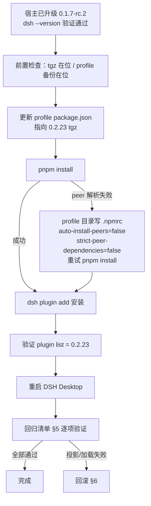

# DSH 宿主升级后 agent-team 插件恢复指引

> 读者：宿主 DSH 已从 0.1.5-rc.1 升级到 0.1.7-rc.2 之后，负责执行插件恢复的 DSH agent。
>
> ## 修订记录
> | 版本 | 说明 |
> |------|------|
> | v1.0 | 2026-09-28 初始稿：随 v0.2.23（commit 87770a2）发布撰写。宿主升级时序、插件安装步骤、回归清单、回滚方案。 |

## 1. 背景与适用条件

- 插件 `@limuyang2/dsh-agent-team` v0.2.23 已完成对宿主 `dsh-v0.1.7-rc.2` 的兼容迁移（QA 审计 PASS，迁移报告见仓库 `docs/artifacts/tech-host-017-compat/`）。
- **v0.2.23 只能在 0.1.7-rc.2 宿主上运行**：它按 0.1.7 的消息结构（ToolResultMessage 顶层字段、compact-checkpoint 来源、自有 source kind `agent-team`）读取数据。在 0.1.5 宿主上安装它会破坏旧会话工具卡投影——这是升级时序约束，不是缺陷。
- 升级前 desktop profile 跑的是 v0.2.22（面向 0.1.5），宿主升级后它预期异常，无需排查，直接按本指引换装。



## 2. 前置检查（全部满足才继续）

1. `dsh --version` 输出 `0.1.7-rc.2`。不是这个版本就停下——插件版本与宿主版本强绑定。
2. 插件包在位：`E:\thirdparty\dsh-plugins\agent-team\dist\limuyang2-dsh-agent-team-0.2.23.tgz`。缺失时从仓库重建：
   ```powershell
   git -C E:\thirdparty\dsh-plugins\agent-team checkout v0.2.23
   cd E:\thirdparty\dsh-plugins\agent-team
   npm install
   New-Item -ItemType Directory -Force -Path dist
   npm pack --pack-destination dist
   ```
3. profile 备份**已完成**（2026-10-08，升级前实测留档），全部位于 `C:\Users\Administrator\.dsh\profiles\desktop\`：

   | 备份文件 | 内容 | 核验结果 |
   |---|---|---|
   | `package.json.bak-0.1.5` | profile 依赖 spec（agent-team@0.2.22 等 10 包） | 与现文件逐字节一致（1003 B） |
   | `cordis.patch.yml.bak-0.1.5` | 用户 patch 层（当前为空数组 `[]`） | 已复制 |
   | `plugin-list-0.1.5.bak.txt` | 升级前插件清单（agent-team **0.2.22**、web-all 0.3.23、mnemon 0.5.9 等 10 包） | 已生成 |
   | `dsh-version-0.1.5.bak.txt` | 升级前宿主版本 `0.1.5-rc.1` | 已生成 |

   回滚时：前两个文件原样复制回去 → `pnpm install` → 按 `plugin-list-0.1.5.bak.txt` 重装各插件（agent-team 装回 `dist/limuyang2-dsh-agent-team-0.2.22.tgz`）。

## 3. 安装步骤

逐条执行，任何一步失败先读错误再行动，禁止跳步：

1. **改 spec**：编辑 `C:\Users\Administrator\.dsh\profiles\desktop\package.json`，把 `@limuyang2/dsh-agent-team` 的 `file:` 依赖改为
   `file:E:/thirdparty/dsh-plugins/agent-team/dist/limuyang2-dsh-agent-team-0.2.23.tgz`
   ⚠️ 必须用文本编辑工具改，禁止 PowerShell `Set-Content`（PS5 会写 UTF-8 BOM 打崩 JSON 解析）。
2. **装依赖**：在 profile 目录执行 `pnpm install --network-concurrency 1`。
   若报 peer 依赖解析失败（已知张力：`dsh-client-runtime@0.1.1-rc.2` 的 peer `dsh-agent ^0.1.1-rc.2` 与 0.1.7-rc.2 预发布规则不相容，宿主侧固有）：在 profile 目录新建 `.npmrc` 写入
   ```
   auto-install-peers=false
   strict-peer-dependencies=false
   ```
   然后重试 `pnpm install --network-concurrency 1`。
3. **装插件**：
   ```powershell
   dsh plugin --profile desktop add -w "E:\thirdparty\dsh-plugins\agent-team\dist\limuyang2-dsh-agent-team-0.2.23.tgz"
   ```
4. **验证版本**：`dsh plugin --profile desktop list` 应显示 `@limuyang2/dsh-agent-team@0.2.23`。
5. **重启 DSH Desktop**（完整退出再启动；不重启 = 跑旧内存模块，验证全部无效）。

## 4. 加载冒烟（重启后第一件事）

1. DSH Web 界面正常打开，无 boot 报错。loader id 已改为 `limuyang2-agent-team`，与官方 `agent-team` 不再冲突——若 boot 日志出现 `duplicate loader entry id`，说明装了带旧 id 的包（<0.2.23），换装 0.2.23。
2. 侧栏能看到 Agent 团队入口，工作台能打开。

## 5. 回归清单（逐项人工验证）

| # | 验证项 | 预期 |
|---|--------|------|
| 1 | 插件在 0.1.7 宿主加载 | 工作台/团队面板正常渲染，无 console 报错 |
| 2 | 旧团队打开 + 旧会话消息投影 | 工具卡片 success/error 形态与升级前一致（B-2 重写点） |
| 3 | 已压缩团队的检查点显示 | 显示「已压缩 N 条历史」notice，不被当普通消息渲染（B-3 重写点） |
| 4 | 团队消息收发 | relay 消息在工作台列正常可见（B-1 kind 迁移点） |
| 5 | 团队指令 | /permission、/plan、/team-compact 可执行 |
| 6 | Workspace 面板 | 文件预览（markdown 渲染/源码切换）、右键删除全链路 |
| 7 | 成员会话 | 中断恢复、消息投递正常 |
| 8 | UI 细节 | 图标正常显示（B-4 改名点）、弹窗 Esc 关闭、链接可点击 |

## 6. 回滚方案

- **仅插件问题**：把 profile `package.json` 的 `file:` 指回 `limuyang2-dsh-agent-team-0.2.22.tgz`（dist 目录仍在）→ `pnpm install` → `dsh plugin add` → 重启。注意 0.2.22 在 0.1.7 宿主上本就不完全兼容，仅作应急回退。
- **宿主本身有问题**：恢复 `package.json.bak-0.1.5` + 重装旧版 DSH Desktop。
- ⚠️ **不可逆点**：0.1.7 宿主把 session 格式 v3→v4 自动迁移，**迁移后的会话数据不能被 0.1.5 宿主读取**。宿主回滚意味着放弃升级期间的增量会话数据，回滚前必须想清楚。

## 7. 已知边界

- `npm run check` 默认 forks 池在本机沙箱会全量 worker 超时，属环境限制；用 `npx vitest run --pool=threads`。
- `V-1~V-6` 行为变化回归（permissionPresets 'auto' 预设、archiveSession 活动准入等）细节见 `docs/artifacts/tech-host-017-compat/06-回归评测.md` §5。
- 若未来安装官方 `@deepseek-ai/dsh-experimental-agent-team-profile`，与本插件无 loader id 冲突（0.2.23 起已隔离），可共存。
